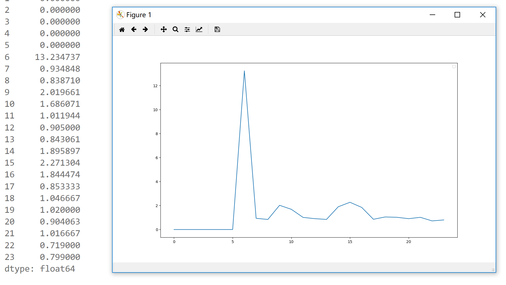

# 数据挖掘新生培训第一阶段报告

> 代码文件可以再我的 GitHub 上查看：https://github.com/Siriussee/DataMiningExercise

## 环境介绍

Windows 10 64位 家庭版

## Python 2.7 的安装

在 python.org [下载](https://www.python.org/downloads/release/python-2714/)py 2.7，在安装过程中选择 Add to PATH 以添加至环境变量。

打开 CMD，输入 `python` 弹出 python 交互界面，安装成功

```
C:\Users\Siriu>python
Python 2.7.12 (v2.7.12:d33e0cf91556, Jun 27 2016, 15:24:40) [MSC v.1500 64 bit (AMD64)] on win32
Type "help", "copyright", "credits" or "license" for more information.
>>>
```

## 安装必要的包

安装 numpy scipy pandas sklearn 包
```
python -m pip install --upgrade pip
pip install --user numpy scipy pandas sklearn
```

安装 MinGW-64 ，并且安装 Xgboost

在交互界面逐一 import 之，没有出现报错，安装成功

## 配置 VScode 下的 python

参见 VS code [官方文档](https://code.visualstudio.com/docs/languages/python)

下载 Python 插件，配置 usersetting 中 py 的路径，即可实现 linting/debugging

## 熟悉 numpy 和 pandas 等库的使用

> 详见 `creating-series.py` & `dataframe.py`

尝试了 series 和 dataframe 对象的构建和运算，和 dataframe 的取行与取列的操作。

> 详见 `test-xgboost.py`

尝试了一下 xgboost 官方文档中的程序，又看了看别人的博客，发现并不懂什么是什么，暂时略过。

## 习题解答过程

### ID 数量统计

使用 pandas 的 `read_csv(file)` 方法将csv文件读入dataframe。

取dataframe的特定列，调用unique方法，取得列的set；调用 `len(set)` 取得set的大小，即 unique_ID 的数量。

路口id，收费站id，车辆id均是同理。

### 分类统计并给出统计数据

这这一部分，我主要完成了两个函数 `get_status_according_to_road_id(road_id_x)` 和 `get_status_according_to_date(date_x)`

这两个函数的主要功能，是从包含了全部 `#road#start_time#time_spent` 的list 中，取出符合要求的一段路程，然后进行统计。具体代码如下：

```python
def get_status_according_to_road_id(road_id_x):
    travel_time_when_road_id_is_x = []
    for each in single_travel_seq:
        id = each.split('#')[0]
        if id == road_id_x:
            travel_time_when_road_id_is_x.append(each.split('#')[2])

    travel_time_when_road_id_is_x = map(eval,travel_time_when_road_id_is_x)
    series_travel_time_when_road_id_is_x = pd.Series(travel_time_when_road_id_is_x)
    print status(series_travel_time_when_road_id_is_x)
```

`get_status_according_to_date(date_x)`函数类似。

随后，对所有road/date循环，即可得到全部 road/date 的统计数据。

```python
for each in unique_road_id:
    print status(each)
```
得到的输出如下：

```
statistic of road 102
总数        13011.000000
最小值           3.150000
25%分位数        8.600000
中位数           9.740000
75%分位数       11.400000
均值           11.064007
最大值        2220.470000
平均绝对偏差        2.965621
方差          423.889644
标准差          20.588580
dtype: float64
```


### 数据可视化

> 此部分对应培训习题第（3）题和数据说明第（4）点。

在这一部分，我统计了 120 号公路 2016-07-23 全天的车流数据，并且按小时分类，求通行时间的均值。最后画出了平均通行时间-时间的统计图。



- 使用`read_csv()`方法读入数据，
- 使用字符串的`split('flag')`方法定位并且筛选所需的通行时间数据，
- 自己写一个求平均数的循环求平均数，
    - 主要是因为这样就可以一步到位不用先分成不同的 list 再调用 `mean()` 方法了
- 最后 pd.Series(mean_list) 转化为序列，然后使用如下代码生成统计图。

```python
plt.plot(series_mean_time_spent.index, series_mean_time_spent)
```

> 这个 matplot 还真是方便啊，虽然说显示出来的图的可调整性比 MATLAB 差远了。


